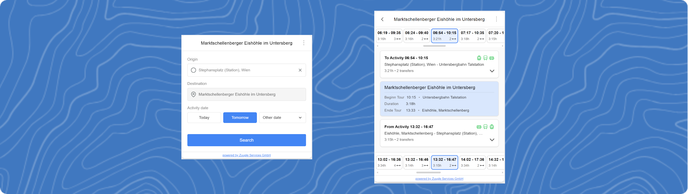

# Diana GreenConnect - Activity Transit Planner Widget




## Table of Contents

* [Project Overview](#project-overview)
* [Features](#features)
* [Installation](#installation)
* [Apply for Access & Security Process](#apply-for-access--security-process)
* [Development](#development)
* [Demo](#demo)
* [Configuration](#configuration)
* [Styling & Theming](#styling--theming)
* [Architecture](#architecture)
* [Deployment](#deployment)
* [Contributing](#contributing)
* [License](#license)

## Project Overview

A modular JavaScript widget that helps users plan transit connections for activities between specified locations. Key capabilities:

* Location autocomplete with suggestions
* Date/time selection with adaptive calendar
* Connection results with visual timelines
* Flexible activity duration warnings
* Mobile-responsive design
* Error handling and fallback UI

Designed for integration in web applications requiring activity transit planning functionality.

## Features

**Core Functionality**

* 🗺️ Interactive suggestion-based location input
* 📅 Adaptive calendar (native on mobile/custom on desktop)
* ⏱ Real-time connection filtering
* 🚦 Activity duration validation
* 🚄 Multi-modal transport visualization

**Technical Highlights**

* CSS Modules with PostCSS processing
* Webpack-based build pipeline
* Accessibility-first implementation
* Configuration validation system
* Comprehensive error handling
* Swipe-friendly mobile UI

## Installation

```
git clone [https://github.com/zuugle-services/DianaWidget.git](https://github.com/zuugle-services/DianaWidget.git)
cd DianaWidget
npm ci
```

## Apply for Access & Security Process

To use the Diana GreenConnect, you need to obtain API credentials which are used to authorize requests to the backend Zuugle Services API. This process ensures secure communication.

### 1. Sign Up and Obtain Credentials

* **Register**: First, you or your organization needs to sign up on the [zuugle-services.net](https://zuugle-services.net) portal.
* **Application Creation**: Upon successful registration and setup, an "Application" will be created for you in the Zuugle Services backend.
* **Get Credentials**: Log in to your dashboard on `zuugle-services.net`. Navigate to the API credentials or application settings section. Here, you will find your unique:
   * `Client ID`: A public identifier for your application.
   * `Client Secret`: A confidential key. **This** secret must be **kept secure and should never be exposed in client-side code.**

### 2. Server-Side Access Token Generation

* **Protect Your Secret**: The `Client Secret` is sensitive. To protect it, you must **not** embed it directly into the widget's JavaScript or any client-side code.
* **Backend Logic**: Your website's backend (server-side code, e.g., PHP, Node.js, Python) is responsible for using the `Client ID` and `Client Secret` to request an **Access Token** from the Zuugle Services OAuth 2.0 endpoint.
   * This is typically done using the "Client Credentials" grant type.

Here's an example of how you might fetch the access token using PHP. This assumes you have a file named `oauth2_functions.php` (containing the `getDianaAccessToken` function) and a `client_id_secret.php` file (defining `CLIENT_ID` and `CLIENT_SECRET`).

```php
<?php
// Ensure you have error reporting for debugging, remove for production
error_reporting(E_ALL);
ini_set("display_errors", 1);

// Include the necessary files
// oauth2_functions.php should contain the getDianaAccessToken function
require_once 'oauth2_functions.php';
// client_id_secret.php should define CLIENT_ID and CLIENT_SECRET constants
require_once 'client_id_secret.php';

// Define the token URL (can be overridden if necessary)
$tokenUrl = "[https://api.zuugle-services.net/o/token/](https://api.zuugle-services.net/o/token/)";

// Call the function to get the token data
$tokenData = getDianaAccessToken(CLIENT_ID, CLIENT_SECRET, $tokenUrl);

if ($tokenData && isset($tokenData['access_token'])) {
    $accessToken = $tokenData['access_token'];
    // Now you have the access token.
    // You would typically pass this token to your frontend/JavaScript.
    // For example, if you're rendering an HTML page with PHP:
    // echo "<script>window.dianaActivityConfig.apiToken = '" . htmlspecialchars($accessToken) . "';</script>";
    // Or, if serving an HTML file, you might replace a placeholder.

    // For demonstration, let's just print it (DO NOT do this in production directly on a page)
    // echo "Access Token: " . htmlspecialchars($accessToken);

} else {
    // Handle the error: token was not obtained
    error_log("Failed to obtain Diana Access Token.");
    // Inform the user or take appropriate action
    // echo "Error: Could not retrieve access token.";
}

?>
```

**Important Security Note:** The `client_id_secret.php` file should define your `CLIENT_ID` and `CLIENT_SECRET` like this and be kept secure on your server:

```php
<?php
// client_id_secret.php
define("CLIENT_ID", "YOUR_ACTUAL_CLIENT_ID");
define("CLIENT_SECRET", "YOUR_ACTUAL_CLIENT_SECRET");
?>
```

Ensure this file is not publicly accessible via the web.

### 3. Configure the Widget with the Access Token

* **Pass Token to Widget**: Once your server obtains an Access Token, it should then pass this token to the DianaWidget when it's initialized on your webpage.
* **Widget Configuration**: The Access Token is provided to the widget via the `apiToken` property in the `window.dianaActivityConfig` object.

```html
<script>
// This accessToken is securely fetched by your server and then passed to the client.
// For example, if using PHP to embed it:
const accessTokenFromServer = "<?php echo htmlspecialchars($php_generated_access_token); ?>";

window.dianaActivityConfig = {
  activityName: "Skiing in Alps",
  // ... other required config (see Configuration section)
  apiToken: accessTokenFromServer, // The token obtained by your server
  // ... optional config (see Configuration section)
};
</script>
<script src="dist/DianaWidget.bundle.js"></script>
```

### 4. Token Expiration and Refresh

* **Token Lifetime**: Access Tokens have a limited lifetime (e.g., 1 hour).
* **Server Responsibility**: Your server-side logic should manage the token's lifecycle. This includes:
   * Caching the token to avoid requesting a new one for every page load.
   * Requesting a new token from the OAuth endpoint before the current one expires or if an API call fails due to an expired token.
* **Updating the Widget**: If a token expires while a user is on the page, the widget might start receiving errors. Your application may need a strategy to fetch a new token from your server and re-initialize the widget or update its configuration.

**In summary:** The `Client Secret` is used by your server to get an `Access Token`. This `Access Token` is then safely passed to the client-side widget. This ensures your `Client Secret` remains secure.

## Development

### Scripts

```
npm run dev     # Start dev server with hot-reload
npm run build   # Create production bundle
npm run analyze # Analyze bundle size
```

### Key Development Patterns

1.  **Diana GreenConnect Widget Initialization**
    Configure through `window.dianaActivityConfig` in host page:

   ```html
   <script>
   window.dianaActivityConfig = {
     activityName: "Skiing in Alps",
     activityType: "Skiing",
     activityStartLocation: "47.422, 10.984", // Example coordinates
     activityStartLocationType: "coordinates",
     activityEndLocation: "Alpine Peak",
     activityEndLocationType: "address",
     activityEarliestStartTime: "09:00",
     activityLatestStartTime: "12:00",
     activityEarliestEndTime: "15:00",
     activityLatestEndTime: "17:00",
     activityDurationMinutes: "180",
     // This token is securely fetched by your server and then passed to the client.
     apiToken: "YOUR_SERVER_GENERATED_ACCESS_TOKEN",
     // ... other optional config
   };
   </script>
   <script src="dist/DianaWidget.bundle.js"></script>
   ```

    Place a `div` with the ID `dianaWidgetContainer` (or a custom ID passed to the constructor) where you want the widget to render:

   ```html
   <div id="dianaWidgetContainer"></div>
   ```

    The widget is instantiated like so (typically after the config and bundle script):

   ```javascript
   new window.DianaWidget(window.dianaActivityConfig, "dianaWidgetContainer");
   ```

    If you use a custom container ID, ensure you pass it as the second argument to the `DianaWidget` constructor.

2.  **Component Structure**
   * `src/core/widget.js`: Main widget class
   * `src/core/styles/widget.css`: Component styles
   * `src/index.js`: DOM initialization

3.  **State Management**
    Internal state machine tracks:
   * Connection results
   * Selected date/time
   * Loading states
   * Validation warnings

## Demo

There is a demo webpage `./index.html` where either the local dev version of the widget or the live version
can be loaded. Different configuration can be tried out here and it works well for testing and modifying the
widget styles.

To run the demo with a development server:

1.  Ensure you have valid credentials and can generate an access token if you intend to test against a live API. For basic UI testing, the default development token might suffice if the API base URL is local or mocked.
2.  Update the `apiToken` in `index.html` within the `window.dianaActivityConfig` with a valid token if needed.
3.  Run `npm run dev`.
4.  Open `index.html` in your browser (usually served at `http://localhost:8080` or similar).

## Configuration

The widget is configured via a JavaScript object, typically `window.dianaActivityConfig`.

**Required Fields**

These fields must be provided in the configuration object for the widget to initialize correctly.

| Option                      | Type          | Description                                                                                                                   | Example                                   |
|:----------------------------|:--------------|:------------------------------------------------------------------------------------------------------------------------------|:------------------------------------------|
| `activityName`              | String        | Name of the activity displayed in the widget header.                                                                          | `"Hiking Trip"`                           |
| `activityType`              | String        | Type identifier for the activity (used internally).                                                                           | `"Hiking"`                                |
| `activityStartLocation`     | String        | Coordinates (`lat,lon`) or address string for the activity start location.                                                    | `"47.72620173410345, 13.042174020936743"` |
| `activityStartLocationType` | String        | Type of the start location. Valid types: `"coordinates"`, `"coord"`, `"coords"`, `"address"`, `"station"`.                    | `"coordinates"`                           |
| `activityEndLocation`       | String        | Coordinates (`lat,lon`) or address string for the activity end location.                                                      | `"47.70487271915757, 13.038710343883247"` |
| `activityEndLocationType`   | String        | Type of the end location. Valid types: `"coordinates"`, `"coord"`, `"coords"`, `"address"`, `"station"`.                      | `"address"`                               |
| `activityEarliestStartTime` | String        | Earliest possible start time for the activity (HH:MM or HH:MM:SS in activity's local timezone, defined by `timezone` config). | `"09:00"` / `"09:00:00"`                  |
| `activityLatestStartTime`   | String        | Latest possible start time for the activity (HH:MM or HH:MM:SS in activity's local timezone, defined by `timezone` config).   | `"14:30"` / `"14:30:00"`                  |
| `activityEarliestEndTime`   | String        | Earliest possible end time for the activity (HH:MM or HH:MM:SS in activity's local timezone, defined by `timezone` config).   | `"12:00"` / `"12:00:00"`                  |
| `activityLatestEndTime`     | String        | Latest possible end time for the activity (HH:MM or HH:MM:SS in activity's local timezone, defined by `timezone` config).     | `"20:00"` / `"20:00:00"`                  |
| `activityDurationMinutes`   | String/Number | Required duration of the activity in minutes. Must be a positive integer.                                                     | `240` or `"240"`                          |

**Important Note on Timezones for Activity Times**: The `activityEarliestStartTime`, `activityLatestStartTime`, `activityEarliestEndTime`, and `activityLatestEndTime` should be provided in the local time of the activity. The widget will use the `timezone` configuration (see Optional Parameters) to correctly interpret these times and convert them to UTC for API requests.

**Optional Parameters**

| Option                             | Type    | Default                             | Description                                                                                                                                                                                                                                              | Example                                           |
|:-----------------------------------|:--------|:------------------------------------|:---------------------------------------------------------------------------------------------------------------------------------------------------------------------------------------------------------------------------------------------------------|:--------------------------------------------------|
| `activityStartLocationDisplayName` | String  | `null`                              | Custom display name for the activity start location, shown in the results view.                                                                                                                                                                          | `"Untersbergbahn Talstation"`                     |
| `activityEndLocationDisplayName`   | String  | `null`                              | Custom display name for the activity end location, shown in the results view.                                                                                                                                                                            | `"Eishöhle, Marktschellenberg"`                   |
| `timezone`                         | String  | `"Europe/Vienna"`                   | IANA timezone identifier (e.g., "America/New_York", "Europe/Berlin"). Used for displaying times and interpreting activity times. Validated using Luxon. Invalid values default to `"Europe/Vienna"`.                                                     | `"America/New_York"`                              |
| `activityStartTimeLabel`           | String  | `null`                              | Custom label for the activity start time displayed in the results view (defaults to localized "Activity Start" or similar).                                                                                                                              | `"Tour Begins"`                                   |
| `activityEndTimeLabel`             | String  | `null`                              | Custom label for the activity end time displayed in the results view (defaults to localized "Activity End" or similar).                                                                                                                                  | `"Tour Ends"`                                     |
| `apiBaseUrl`                       | String  | `"https://api.zuugle-services.net"` | Base URL for the Zuugle Services API.                                                                                                                                                                                                                    | `"http://localhost:8000/"`                        |
| `apiToken`                         | String  | `"development-token"`               | API token for authenticating with Zuugle Services. **For production, this MUST be a server-obtained Access Token.** The default token is for development/testing only. See [Apply for Access & Security Process](#apply-for-access--security-process).   | `"your-server-obtained-access-token"`             |
| `language`                         | String  | `"EN"`                              | Language for the widget UI (`"EN"` or `"DE"` currently supported). Falls back to `EN` if an unsupported language is provided.                                                                                                                            | `"DE"`                                            |
| `cacheUserStartLocation`           | Boolean | `true`                              | If `true`, the user's last entered start location (address and coordinates) will be cached in the browser's localStorage.                                                                                                                                | `false`                                           |
| `userStartLocationCacheTTLMinutes` | Number  | `15`                                | Time in minutes for how long the cached user start location remains valid. After this period, the cached value is ignored.                                                                                                                               | `120` (for 2 hours)                               |
| `overrideUserStartLocation`        | String  | `null`                              | A specific start location (address string or "latitude,longitude" string) to pre-fill the origin input. This value bypasses any cached location.                                                                                                         | `"Vienna Central Station"` or `"48.2082,16.3738"` |
| `overrideUserStartLocationType`    | String  | `null`                              | Specifies the type of `overrideUserStartLocation`. Must be `"address"` or `"coordinates"` (or `"coord"`, `"coords"`). Required if `overrideUserStartLocation` is set.                                                                                    | `"address"` or `"coordinates"`                    |
| `displayStartDate`                 | String  | `null`                              | Optional start date (YYYY-MM-DD) for widget visibility. If set, the widget will only display on or after this date.                                                                                                                                      | `"2024-06-01"`                                    |
| `displayEndDate`                   | String  | `null`                              | Optional end date (YYYY-MM-DD) for widget visibility. If set, the widget will only display on or before this date.                                                                                                                                       | `"2024-06-30"`                                    |
| `destinationInputName`             | String  | `null`                              | Custom value for the destination input field. If set, this is used instead of the general activity name.                                                                                                                                                 | `"activity-destination"`                          |
| `multiday`                         | Boolean | `false`                             | If set to `true`, enables multi-day activity mode. When enabled, the widget allows selection of different dates for start and end locations, supporting activities that span multiple days. This affects the calendar UI and connection search behavior. | `true`                                            |
| `overrideActivityStartDate`        | String  | `null`                              | Optional date (YYYY-MM-DD) to pre-select as the activity start date in the calendar. If provided, this date will be automatically selected when the widget loads.                                                                                        | `"2024-06-15"`                                    |
| `overrideActivityEndDate`          | String  | `null`                              | Optional date (YYYY-MM-DD) to pre-select as the activity end date in the calendar. Only used when `multiday` is `true`. If provided, this date will be automatically selected when the widget loads.                                                     | `"2024-06-16"`                                    |
| `activityDurationDaysFixed`        | Number  | `null`                              | When set in multiday mode, fixes the duration of the activity to the specified number of days. This overrides the end date selection, automatically calculating it based on the start date and fixed duration.                                           | `3`                                               |
| `share`                            | Boolean | `true`                              | If `true`, displays a share button in the widget menu, allowing users to generate a shareable link for their selected journey.                                                                                                                           | `false`                                           |
| `allowShareView`                   | Boolean | `true`                              | If `true`, the widget can be loaded in a read-only "share view" when a `diana-share` URL parameter is present. Set to `false` to disable this behavior.                                                                                                  | `false`                                           |
| `shareURLPrefix`                   | String  | `null`                              | The base URL to use when generating share links. If `null`, it defaults to the current page's URL (`window.location.href`).                                                                                                                              | `"https://my-domain.com/planner/"`                |

## Styling & Theming

The widget uses CSS custom properties (variables) for easy theming. Since the widget renders its content into a **Shadow DOM** for style encapsulation, you must apply your theme overrides to the **host element**. By default, this is the `div` with the ID `#dianaWidgetContainer`.

**CSS Features**

* Custom properties for theming
* Mobile-first responsive design
* Accessible focus states
* Adaptive calendar UI
* CSS Grid/Flex layouts

**Theming Variables**

To override the default theme, define your custom property values in a CSS rule targeting the widget's container element. These variables will be passed through the Shadow DOM boundary.

Example Override:

```css
#dianaWidgetContainer {
  --primary-color: #ff6f61; /* A nice coral color */
  --bg-secondary: #f8f8f8;
  --text-primary: #222;
  --border-primary: #dbdbdb;
  border-radius: 12px; /* You can also style the container itself */
  overflow: hidden;
  box-shadow: 0 8px 24px rgba(0,0,0,0.1);
}
```

Here is a list of the available variables you can override:

```css
#dianaWidgetContainer {
    /* Base Colors */
    --primary-color: #4285f4;   /* Main interactive elements, highlights */
    --secondary-color: #ccc;    /* Borders, disabled states */
    --warning-color: #ffd38c;   /* Warning backgrounds (e.g., duration warning) */
    --error-color: #dc3545;     /* Error messages */
    --success-color: #28a745;   /* Success indicators (if needed) */

    /* Icon Colors */
    --icon-input-color: #656C6E; /* Icons inside input fields */

    /* Backgrounds */
    --bg-primary: #fff;         /* Main background (form page, sliders) */
    --bg-secondary: #fafafa;    /* Secondary background (results page) */
    --bg-tertiary: #f5f5f5;     /* Disabled input background */
    --bg-hover: #f0f0f0;        /* Hover states for suggestions, buttons */
    --bg-info: #dee4f3;         /* Background for the activity time box */
    --bg-transparent: rgba(128,128,128,0.05); /* Transparent background utility */

    /* Text Colors */
    --text-primary: #000;       /* Primary text, headings */
    --text-secondary: #333;     /* Secondary text, input values */
    --text-tertiary: #666;      /* Tertiary text, labels, back button */
    --text-muted: #838383;      /* Muted text (e.g., time spans in details) */
    --text-disabled: #999;      /* Disabled text, placeholders, footer */

    /* Borders */
    --border-primary: #e0e0e0;   /* Main borders (inputs, headers, footer) */
    --border-secondary: #d3d3d3; /* Secondary borders */
    --border-tertiary: #eaeaea;  /* Tertiary borders (calendar body, hr) */

    /* Shadows */
    --shadow-light: rgba(0,0,0,0.1);   /* Light box shadows */
    --shadow-medium: rgba(0,0,0,0.15); /* Medium box shadows (calendar) */
    --shadow-dark: rgba(0,0,0,0.2);    /* Dark box shadows (modal container) */
}
```

**Sizing options**

By setting a `max-height` on the `dianaWidgetContainer` you can also set boundaries for the sizing of the widget.
Setting `max-width` on the container is not recommended, but theoretically possible. The reason is, that the widget starts to look very squished.

Example:

```html
<div id="dianaWidgetContainer" style="max-height: 600px;">
```

You can even set more complex styles to the outermost container, e.g.:

```css
#dianaWidgetContainer {
   background-color: #ffffff;
   border-radius: 0.75rem; /* Border for container */
   box-shadow: 0 10px 15px -3px rgb(0 0 0 / 0.1), 0 4px 6px -4px rgb(0 0 0 / 0.1); /* Soft shadow */
   overflow: hidden; /* To keep the shadow from leaking onto the main page */
   transition: box-shadow 0.3s ease-in-out; /* Transition animation for shadow */
}
#dianaWidgetContainer:hover {
    box-shadow: 0 20px 25px -5px rgb(0 0 0 / 0.1), 0 8px 10px -6px rgb(0 0 0 / 0.1); /* Hard shadow on hover */
}
```

## Architecture

```
├── dist/                   # Built assets
├── src/
│   ├── core/
│   │   ├── widget.js       # Main widget logic
│   │   ├── Calendar.js     # Calendar logic 
│   │   └── styles/         # Component styles (CSS)
│   ├── translations.js     # Language file
│   ├── utils.js            # Utility functions
│   ├── datetimeUtils.js    # Datetime utility functions
│   └── index.js            # Initialization entry point
├── webpack.config.js       # Build configuration
└── postcss.config.js       # CSS processing configuration
```

**Key Modules**

1.  **Widget Core** (`widget.js`)
   * Configuration validation
   * DOM injection & manipulation
   * API communication (address autocomplete, connections)
   * State management (selected date, connections, loading, errors)
   * Calendar logic (custom and native handling)
   * Time conversions and calculations (using Luxon)

2.  **Styling System**
   * CSS Modules with hashed class names (via `css-loader`)
   * PostCSS pipeline with:
      * Nesting rules (`postcss-nesting`)
      * Minification (`cssnano`)

3.  **Build System**
   * Webpack 5 bundling the JavaScript and injecting CSS
   * UMD output for compatibility
   * Development server with hot module replacement

## Deployment

**CI/CD Pipeline** (`.github/workflows/deploy.yml`)

1.  Triggered on releases (tags pushed to GitHub)
2.  Installs dependencies and builds the production bundle (`npm run build`)
3.  Deploys the bundled file (`dist/DianaWidget.bundle.js`) via SFTP to the specified server.

**Hosting Requirements**

* Serve the `DianaWidget.bundle.js` file (e.g., from a CDN or your web server).
* Include the widget script in your HTML page *after* defining the `window.dianaActivityConfig` object and ensuring `apiToken` is populated correctly for your environment.
* Ensure the host page has a `<div id="dianaWidgetContainer"></div>` (or your custom ID) element.

## Contributing

We welcome contributions! Here's how to help:

**Development Process**

1.  Fork the repository.
2.  Create a feature branch (`git checkout -b feature/your-feature-name`).
3.  Make your changes.
4.  Ensure the code builds (`npm run build`).
5.  Submit a Pull Request (PR) with:
   * A clear description of the changes.
   * Any necessary updates to this README.
   * Information about how to test your changes.

**Why Contribute?**

* Solve real-world transit planning challenges for activities.
* Work with modern web technologies (ES modules, CSS variables, Webpack).
* Impact users needing efficient travel planning.
* Learn from a production-grade widget codebase.

## License

Proprietary software © Zuugle Services GmbH. Contact team@zuugle-services.net for licensing inquiries.

> Let's build better activity planning experiences together! 🏔️🚌✨