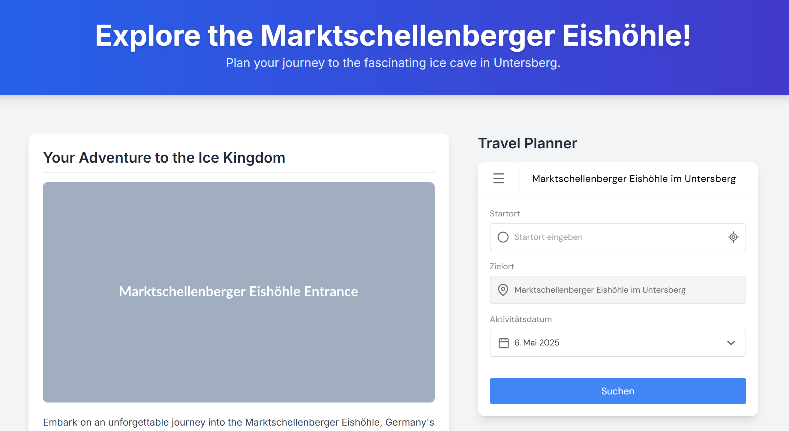

# DianaWidget - Activity Transit Planner Widget


## Table of Contents
- [Project Overview](#project-overview)
- [Features](#features)
- [Installation](#installation)
- [Development](#development)
- [Demo](#demo)
- [Configuration](#configuration)
- [Styling & Theming](#styling--theming)
- [Architecture](#architecture)
- [Deployment](#deployment)
- [Contributing](#contributing)
- [License](#license)

---

## Project Overview
A modular JavaScript widget that helps users plan transit connections for activities between specified locations. Key capabilities:
- Location autocomplete with suggestions
- Date/time selection with adaptive calendar
- Connection results with visual timelines
- Flexible activity duration warnings
- Mobile-responsive design
- Error handling and fallback UI

Designed for integration in web applications requiring activity transit planning functionality.

---

## Features
**Core Functionality**
- 🗺️ Interactive map-based location input
- 📅 Adaptive calendar (native on mobile/custom on desktop)
- ⏱ Real-time connection filtering
- 🚦 Activity duration validation
- 🚄 Multi-modal transport visualization

**Technical Highlights**
- CSS Modules with PostCSS processing
- Webpack-based build pipeline
- Accessibility-first implementation
- Configuration validation system
- Comprehensive error handling
- Swipe-friendly mobile UI

---

## Installation
```bash
git clone [https://github.com/zuugle-services/DianaWidget.git](https://github.com/zuugle-services/DianaWidget.git)
cd DianaWidget
npm ci
```

---

## Development

### Scripts
```bash
npm run dev     # Start dev server with hot-reload
npm run build   # Create production bundle
npm run analyze # Analyze bundle size
```

### Key Development Patterns
1. **Widget Initialization**
   Configure through `window.dianaActivityConfig` in host page:
   ```html
   <script>
   window.dianaActivityConfig = {
     activityName: "Skiing in Alps",
     // ... other required config
     apiToken: "your-api-token",
     // ... optional config
   };
   </script>
   <script src="dist/DianaWidget.bundle.js"></script>
   ```
   Place a `div` with the ID `dianaWidgetContainer` where you want the widget to render:
   ```html
   <div id="dianaWidgetContainer"></div>
   ```

2. **Component Structure**
   - `src/core/widget.js`: Main widget class
   - `src/core/styles/widget.css`: Component styles
   - `src/index.js`: DOM initialization

3. **State Management**
   Internal state machine tracks:
   - Connection results
   - Selected date/time
   - Loading states
   - Validation warnings

---

## Demo

There is a demo webpage `./index.html` where either the local dev version of the widget or the live version
can be loaded. Different configuration can be tried out here and it works well for testing and modifying the 
widget styles.



---

## Configuration

The widget is configured via a JavaScript object.

**Required Fields**

| Option                      | Type   | Description                                                                | Example                   |
|:----------------------------|:-------|:---------------------------------------------------------------------------|:--------------------------|
| `activityName`              | String | Name of the activity displayed in the widget header.                       | `"Skiing Trip"`           |
| `activityType`              | String | Type identifier for the activity (used internally).                        | `"SKIING"`                |
| `activityStartLocation`     | String | Coordinates (`lat,lon`) or address string for the activity start location. | `"47.715575,15.804045"`   |
| `activityStartLocationType` | String | Type of the start location (`"coordinates"` or `"address"`).               | `"coordinates"`           |
| `activityEndLocation`       | String | Coordinates (`lat,lon`) or address string for the activity end location.   | `"Main Station, Vienna"`  |
| `activityEndLocationType`   | String | Type of the end location (`"coordinates"` or `"address"`).                 | `"address"`               |
| `activityEarliestStartTime` | String | Earliest possible start time for the activity (HH:MM or HH:MM:SS).         | `"09:00"`                 |
| `activityLatestStartTime`   | String | Latest possible start time for the activity (HH:MM or HH:MM:SS).           | `"11:30:00"`              |
| `activityEarliestEndTime`   | String | Earliest possible end time for the activity (HH:MM or HH:MM:SS).           | `"15:00"`                 |
| `activityLatestEndTime`     | String | Latest possible end time for the activity (HH:MM or HH:MM:SS).             | `"18:00"`                 |
| `activityDurationMinutes`   | Number | Required duration of the activity in minutes.                              | `240`                     |
| `apiToken`                  | String | Your API token for accessing Zuugle Services.                              | `"your-secret-api-token"` |

**Optional Parameters**

| Option                             | Type   | Default                             | Description                                                                        | Example                   |
|:-----------------------------------|:-------|:------------------------------------|:-----------------------------------------------------------------------------------|:--------------------------|
| `activityStartLocationDisplayName` | String | `null`                              | Custom display name for the activity start location.                               | `"Mountain Base Camp"`    |
| `activityEndLocationDisplayName`   | String | `null`                              | Custom display name for the activity end location.                                 | `"Valley Station"`        |
| `timezone`                         | String | `"Europe/Vienna"`                   | IANA timezone identifier for displaying times and calculating dates.               | `"America/New_York"`      |
| `activityStartTimeLabel`           | String | `null`                              | Custom label for the activity start time (defaults to localized "Activity Start"). | `"Check-in Time"`         |
| `activityEndTimeLabel`             | String | `null`                              | Custom label for the activity end time (defaults to localized "Activity End").     | `"Lift Closing Time"`     |
| `apiBaseUrl`                       | String | `"https://api.zuugle-services.net"` | Base URL for the Zuugle Services API.                                              | `"http://localhost:8000"` |
| `language`                         | String | `"EN"`                              | Language for the widget UI (`"EN"` or `"DE"` currently supported).                 | `"DE"`                    |

---

## Styling & Theming

The widget uses CSS custom properties (variables) for easy theming. You can override these variables in your own CSS to match your application's look and feel.

**CSS Features**
- Custom properties for theming
- Mobile-first responsive design
- Accessible focus states
- Adaptive calendar UI
- CSS Grid/Flex layouts

**Theming Variables**

Define these in a CSS rule targeting `.diana-container`:

```css
/* Base Colors */
--primary-color: #4285f4;   /* Main interactive elements, highlights */
--secondary-color: #ccc;    /* Borders, disabled states */
--warning-color: #ffd38c;   /* Warning backgrounds (e.g., duration warning) */
--error-color: #dc3545;     /* Error messages */
--success-color: #28a745;   /* Success indicators (if needed) */

/* Icon Colors */
--icon-input-color: #656C6E; /* Icons inside input fields */

/* Backgrounds */
--bg-primary: #fff;         /* Main background (form page, sliders) */
--bg-secondary: #fafafa;    /* Secondary background (results page) */
--bg-tertiary: #f5f5f5;     /* Disabled input background */
--bg-hover: #f0f0f0;        /* Hover states for suggestions, buttons */
--bg-info: #dee4f3;         /* Background for the activity time box */
--bg-transparent: rgba(128,128,128,0.05); /* Transparent background utility */

/* Text Colors */
--text-primary: #000;       /* Primary text, headings */
--text-secondary: #333;     /* Secondary text, input values */
--text-tertiary: #666;      /* Tertiary text, labels, back button */
--text-muted: #838383;      /* Muted text (e.g., time spans in details) */
--text-disabled: #999;      /* Disabled text, placeholders, footer */

/* Borders */
--border-primary: #e0e0e0;   /* Main borders (inputs, headers, footer) */
--border-secondary: #d3d3d3; /* Secondary borders */
--border-tertiary: #eaeaea;  /* Tertiary borders (calendar body, hr) */

/* Shadows */
--shadow-light: rgba(0,0,0,0.1);   /* Light box shadows */
--shadow-medium: rgba(0,0,0,0.15); /* Medium box shadows (calendar) */
--shadow-dark: rgba(0,0,0,0.2);    /* Dark box shadows (modal container) */
```

Example Override:
```css
.diana-container {
  --primary-color: #ff6f61; /* Coral primary color */
  --bg-secondary: #f8f8f8;
  --text-primary: #222;
}
```

**Sizing options**

By setting a `max-height` on the `dianaWidgetContainer` you can also set boundaries for the sizing of the widget.
Setting `max-width` on the container is not recommended, but theoretically possible. The reason is, that the widget starts to look very squished.

Example:
```html
<div id="dianaWidgetContainer" style="max-height: 600px;">
```

You can even set more complex styles to the outermost container, e.g.:
```css
#dianaWidgetContainer {
   background-color: #ffffff;
   border-radius: 0.75rem; /* Border for container */
   box-shadow: 0 10px 15px -3px rgb(0 0 0 / 0.1), 0 4px 6px -4px rgb(0 0 0 / 0.1); /* Soft shadow */
   overflow: hidden; /* To keep the shadow from leaking onto the main page */
   transition: box-shadow 0.3s ease-in-out; /* Transition animation for shadow */
}
#dianaWidgetContainer:hover {
    box-shadow: 0 20px 25px -5px rgb(0 0 0 / 0.1), 0 8px 10px -6px rgb(0 0 0 / 0.1); /* Hard shadow on hover */
}
```

---

## Architecture
```bash
├── dist/                   # Built assets
├── src/
│   ├── core/
│   │   ├── widget.js       # Main widget logic
│   │   └── styles/         # Component styles (CSS)
│   ├── translations.js     # Language file
│   └── index.js            # Initialization entry point
├── webpack.config.js       # Build configuration
└── postcss.config.js       # CSS processing configuration
```

**Key Modules**
1. **Widget Core** (`widget.js`)
   - Configuration validation
   - DOM injection & manipulation
   - API communication (address autocomplete, connections)
   - State management (selected date, connections, loading, errors)
   - Calendar logic (custom and native handling)
   - Time conversions and calculations (using Luxon)

2. **Styling System**
   - CSS Modules with hashed class names (via `css-loader`)
   - PostCSS pipeline with:
     - Nesting rules (`postcss-nesting`)
     - Minification (`cssnano`)

3. **Build System**
   - Webpack 5 bundling the JavaScript and injecting CSS
   - UMD output for compatibility
   - Development server with hot module replacement

---

## Deployment
**CI/CD Pipeline** (`.github/workflows/deploy.yml`)
1. Triggered on releases (tags pushed to GitHub)
2. Installs dependencies and builds the production bundle (`npm run build`)
3. Deploys the bundled file (`dist/DianaWidget.bundle.js`) via SFTP to the specified server.

**Hosting Requirements**
- Serve the `DianaWidget.bundle.js` file (e.g., from a CDN or your web server).
- Include the widget script in your HTML page *after* defining the `window.dianaActivityConfig` object.
- Ensure the host page has a `<div id="dianaWidgetContainer"></div>` element.

---

## Contributing
We welcome contributions! Here's how to help:

**Development Process**
1. Fork the repository.
2. Create a feature branch (`git checkout -b feature/your-feature-name`).
3. Make your changes.
4. Ensure the code builds (`npm run build`).
5. Submit a Pull Request (PR) with:
   - A clear description of the changes.
   - Any necessary updates to this README.
   - Information about how to test your changes.

**Why Contribute?**
- Solve real-world transit planning challenges for activities.
- Work with modern web technologies (ES modules, CSS variables, Webpack).
- Impact users needing efficient travel planning.
- Learn from a production-grade widget codebase.

---

## License
Proprietary software © Zuugle Services GmbH. Contact team@zuugle-services.net for licensing inquiries.

---

> Let's build better activity planning experiences together! 🏔️🚌✨